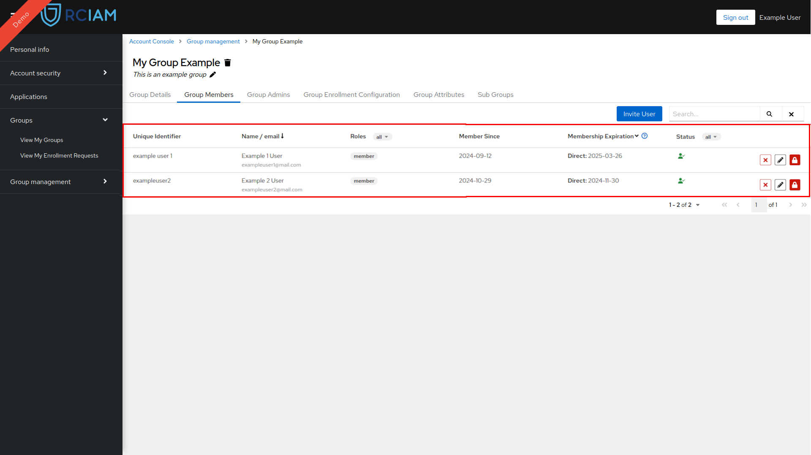

# Groups

## Membership Managment

### View Group Members

1. Login to [Keycloak Account Console](https://kc-example/account/#/) using any of the login credentials already linked to your RCIAM account.
2. Locate your group in the [Group Management Page](https://kc-example/account/#/groups/admingroups) and access the Group Configuration Page by clicking it.

3. To view the existing members, select the Group Members tab. 

### Add Group Members

#### By Invitation

Users can be added to a group by sending an email invitation. Users receiving the invitation can login to Keycloak Account Console with their RCIAM account and accept or reject the invitation to the group.

Sending an email invitation to a User to join a group can be achieved by: 

1. Login to [Keycloak Account Console](https://kc-example/account/#/) using any of the login credentials already linked to your RCIAM account.
2. Locate your group in the [Group Management Page](https://kc-example/account/#/groups/admingroups) and access the Group Configuration Page by clicking it.

3. Select the Group Members tab.

4. Click the Invite User button that opens the invitation pop-up window.

5. Select an Enrollment Configuration

6. Select the role(s) that you want the user have in the Group and click Next

7. Select the user from the drop down selection input or enter an email address and click Send Invitation. 

> **_NOTE:_**  Once a user accepts or reject an invitation email notification will be sent to admins of the group

#### By Enrollment URL

Users can be added to a group by creating an Enrollment Request through an enrollment url. There are two types of enrollment url, one that contains all public/visible group Enrollments and one that is tied to a specific Enrollment. 

Α) Sharing an Enrollment URL that contains all the public/visible group Enrollments following these steps:

1. Login to [Keycloak Account Console](https://kc-example/account/#/) using any of the login credentials already linked to your RCIAM account.
2. Locate your group in the [Group Management Page](https://kc-example/account/#/groups/admingroups) and access the Group Configuration Page by clicking it.

3. Select the more options and from the available options select the “Copy enrollment link to this group”.

4. Share the copied Enrollment URL with the User. 

> **_NOTE:_** Once a user submits an enrollment request admins of the group will receive an email notification.

B) Sharing an Enrollment URL for a specific Enrollment

1. Login to [Keycloak Account Console](https://kc-example/account/#/) using any of the login credentials already linked to your RCIAM account.
2. Locate your group in the [Group Management Page](https://kc-example/account/#/groups/admingroups) and access the Group Configuration Page by clicking it.

3. Select the Group Enrollment Tab 

4. Locate the desired Enrollment making sure it is active
5. Select the more options and from the available options select the “Copy enrollment link to this group”.

6. Share the copied Enrollment URL with the User. 

> **_NOTE:_** Once a user submits an enrollment request admins of the group will receive an email notification.

### Remove Member from Group

1. Login to [Keycloak Account Console](https://kc-example/account/#/) using any of the login credentials already linked to your RCIAM account.
2. Locate your group in the [Group Management Page](https://kc-example/account/#/groups/admingroups) and access the Group Configuration Page by clicking it.

3. Select the Group Members tab.

4. Locate the User you want to remove from the group
5. Click the X button and then the Yes button at the confirmation pop-up window

> **_NOTE:_**  Once a group member is removed admins of the group and the removed user will receive an email notification

### Manage Group Member Roles

1. Login to [Keycloak Account Console](https://kc-example/account/#/) using any of the login credentials already linked to your RCIAM account.
2. Locate your group in the [Group Management Page](https://kc-example/account/#/groups/admingroups) and access the Group Configuration Page by clicking it.

3. Select the Group Members tab.

4. Locate the User you want to alter their roles.
5. Click the edit button next to their assigned roles.

6. Alter their roles by selecting the desired ones from the available options.

7. To save edited member roles click the OK button.

### Suspend or Activate Group Member
	
User memberships can be suspended or activated by a group admin by following these steps: 

1. Login to [Keycloak Account Console](https://kc-example/account/#/) using any of the login credentials already linked to your RCIAM account.
2. Locate your group in the [Group Management Page](https://kc-example/account/#/groups/admingroups) and access the Group Configuration Page by clicking it.

3. Select the Group Members tab.

4. Locate the User you want to suspend or activate their membership.
5. Click the suspend/activate button to open the confirmation pop-up window.

6. Optionally provide a justification for your action that will be included in the notification sent to the User and the group Admins.

7. Click the YES button to submit your action

> **_NOTE:_**  Once a group member is activated/suspended, admins of the group and the user will receive an email notification.

## Admin Management

### View Group Admins

1. Login to [Keycloak Account Console](https://kc-example/account/#/) using any of the login credentials already linked to your RCIAM account.
2. Locate your group in the [Group Management Page](https://kc-example/account/#/groups/admingroups) and access the Group Configuration Page by clicking it.

3. Select the Group Admins Tab.

4. Group Admin details are available in list form.

### Add Group Admin

1. Login to [Keycloak Account Console](https://kc-example/account/#/) using any of the login credentials already linked to your RCIAM account.
2. Locate your group in the [Group Management Page](https://kc-example/account/#/groups/admingroups) and access the Group Configuration Page by clicking it.

3. Select the Group Admins Tab.

4. Use the input located in the Add New Group Admin section to search for a user to add as a group admin, or type a valid email address to send an invitation.   

> **_NOTE:_**   Selecting a user discovered in the select input and will add the user immediately.

> **_NOTE:_**  Once a User accepts or rejects an invitation and when a user is added directly to a group group admins receive email notification

### Remove Group Admin

1. Login to [Keycloak Account Console](https://kc-example/account/#/) using any of the login credentials already linked to your RCIAM account.
2. Locate your group in the [Group Management Page](https://kc-example/account/#/groups/admingroups) and access the Group Configuration Page by clicking it.

3. Select the Group Admins Tab.

4. Locate User you want to remove from being an admin and click the X button

5. Click the YES button in the confirmation pop-up window
   
> **_NOTE:_** Once a group admin is removed from a group he and all other admins are sent an email notification

## Manage Enrollment Configurations

User enrols to a group using a specific enrollment configuration, each enrollment has a configuration that defines the following things:

**Enrollment Name:** The identifying name of the enrollment.

**Membership Expiration:** The duration of the memberships of users enrolled with this enrollment. 

> Membership Expiration can also be indefinite is configuration allows it.

**Start Date:** Allows for memberships to be activated in future time and not directly after an enrollment is completed.

**Requires Approval:** If true enrollment requests submitted by user need to be approved by an administrator.

**Comments:** If activated Users that are submitting an enrollment request need to also provide additional information.

**Acceptable Use Policy (AUP):** Acceptable Use Policy in the form of a URL.

**Available Roles:**  Available roles to users using this enrollment.

**Multiselect Roles:** If activated users using this enrollment can select multiple roles.

**Visible to non-members:** If activated the enrollment will be available in the Group Enrollment discovery page.

**Is Active:** Only active enrollments can be used for user enrollments.

### Create Enrollment Configuration

1. Login to [Keycloak Account Console](https://kc-example/account/#/) using any of the login credentials already linked to your RCIAM account.
2. Locate your group in the [Group Management Page](https://kc-example/account/#/groups/admingroups) and access the Group Configuration Page by clicking it.

3. Select the Group Enrollment Tab 

4. Click on the + button located in the table header to open the creation window

5. Fill the form with the necessary information and click the Create button to create the Enrollment Configuration

### Update Enrollment Configuration

1. Login to [Keycloak Account Console](https://kc-example/account/#/) using any of the login credentials already linked to your RCIAM account.
2. Locate your group in the [Group Management Page](https://kc-example/account/#/groups/admingroups) and access the Group Configuration Page by clicking it.

3. Select the Group Enrollment Tab 

4. Locate the Enrollment Configuration you want to update in the list.
5. Select the Enrollment Configuration you want to update by clicking on it.

6. Edit the fields you want to update and click the SAVE button to update the Enrollment Configuration

### Delete Enrollment Configuration

1. Login to [Keycloak Account Console](https://kc-example/account/#/) using any of the login credentials already linked to your RCIAM account.
2. Locate your group in the [Group Management Page](https://kc-example/account/#/groups/admingroups) and access the Group Configuration Page by clicking it.

3. Select the Group Enrollment Tab 

4. Locate the Enrollment Configuration you want to delete in the list.
5. Select the Enrollment Configuration you want to delete by clicking on it.

6. Click the trash icon next to the Enrollment Configuration name.
 
7. Click the YES button to delete the Enrollment Configuration in the confirmation pop-up window. 

## Review Enrollment Request

Once a enrollment request to join a group is submitted admins of the group are notified to review the request if that request requires approval.
 
To review an enrollment request follow these steps:

1. Login to [Keycloak Account Console](https://kc-example/account/#/) using any of the login credentials already linked to your RCIAM account.
2. Access the [Review Enrollment Requests](https://kc-example/account/#/groups/groupenrollments) page available in the Group Management Section.

3. Locate the enrollment request In the list of all pending requests and click on the Review Button to open the Review Page.

4. Check all the information about the User and his Membership.
5. Optionally Leave a justification comment for your Review Action.
6. Approve the request by clicking the green Approve button or reject it by clicking the red Reject button.

> **_NOTE:_** After approving or denying an enrollment request email notifications are sent to the requesting user and other administrators of the group

## Enrollment Request Details

Information Available when reviewing an enrollment request:

### General Details

**Submission Date:** Date and time of the submission of the request by the user.

**Enrollment Request Status:** Status of the request. (Pending Approval, Approved, Rejected)

### User Details

**Full Name:**  Full name of the user submitting the request.

**Email:** Email address of the user submitting the request.

**Identity Assurance:** ????

**Linked Identity Providers:** 

### Membership Details

**Group Name:** Name of the group

**Enrollment Name:** Name of the enrollment configuration used 

**Group Roles:** List of the roles that the user will acquire from this enrollment request

**Acceptable User Policy (AUP):** Link of the AUP that the user has approved

**Membership Expiration Days:** The duration of the membership in days 

**Comments (or custom name):** Additional information from the user submitting the request. 

