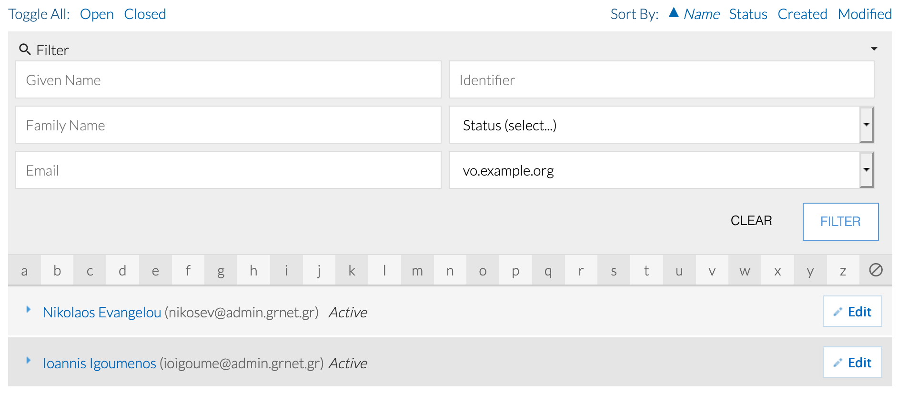
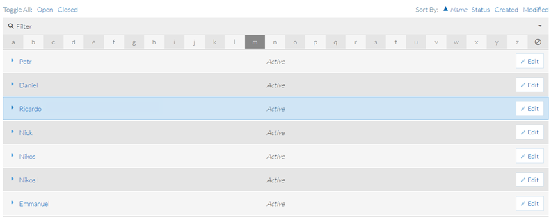

# Virtual Organisations

This page contains information about using RCIAM for managing your Virtual
Organisation (VO).

## Background

In simple terms a Virtual Organisation (VO) is just a group of users. In
RCIAM VOs are created to group researchers who aim to share resources across the
services to achieve a common goal as part of a scientific collaboration.

If you are interested in creating your own VO, please see instructions in the
section [below](#vo-management).

## VO management

VOs in RCIAM are represented as Collaborative Organisation Units (COUs). A
COU is more than just a group. It is the concept of groups combined with
membership management and advanced enrolment workflows. COUs can also be
organised in a hierarchical structure for creating groups or subgroups within a
VO.

It is assumed that VO managers and members have already registered their RCIAM
account (A step-by-step guide is provided in this [link](../user/signup.md).

### Registering your VO

The person initiating the registration is called the **VO manager**. After the
VO is set up and operational, the VO manager is the person who is primarily
responsible for the operation of the VO and for providing sufficient information
about VO activities for RCIAM and for VO members (to both people and sites).

### Viewing VO members

1. Login to [RCIAM registry](https://rciam.example.org/registry) using any of the
   login credentials already linked to your RCIAM account.

1. To view the existing members, expand the **People** drop down menu and click
   on **My _VO-NAME_ Population** (for example, **My vo.example.org
   Population**)

   

1. Then you are able to see all the VO members.

   

### Accepting new VO members

Users can request membership in your VO by following the VO enrollment URL. The
enrollment URL has the following form:

`https://rciam.example.org/registry/co_petitions/start/coef:##` where `##` is the
unique numeric identifier for the enrollment flow of your VO.

Once a user submits a VO membership petition, all VO managers are notified with
an email containing a link to the petition. Any of the VO managers can then
review the petition and either **approve** or **deny** the request.

The VO enrollment URL can be found through the RCIAM Registry:

1. Login to [RCIAM registry](https://rciam.example.org/registry) using any of the
   login credentials already linked to your RCIAM account.

1. Expand the **People** drop down menu and click **Enroll**.

   

1. Copy the **Begin** link of the Enrollment flow of the VO you want the user to
   join and send it to the user

   

1. Once the user submits the VO membership request, the **Role Attributes**
   section of their profile page will include the new VO membership role in
   **Pending Approval** status

   

1. Once the VO manager accepts the new member, the **Role Attributes** section
   of the user's profile page will include the VO membership role in **Active**
   status

   

### Managing VO groups

VO groups can only be created by RCIAM platform administrators. Please
contact `faai` `<AT>` `grnet.gr` indicating the following
information for every (sub)group that you need to add/remove to/from your VO:

- **VO name**
- **Group name**
- **Group description**
- Optional, **Group manager(s)**, i.e. the RCIAM identifiers (in the form of
  `"xyz@example.org"`) of one or more users responsible for managing the VO group
  members. Group managers can also appoint other users as (sub)group managers.
  The manager(s) of the VO (or any parent group) are implicitly managers of the
  group. You can provide additional RCIAM user identifiers to extend the list
  of group managers.
- Optional, **Parent VO group name** (in the case of a hierarchical group, e.g.
  `<VO>` --> `<PARENT_GROUP>` --> `<GROUP>`)

**Known limitation:** Group names must be unique so the names you suggest may
need to be adjusted by the RCIAM administrators to guarantee their
uniqueness.

#### Adding members to VO groups

1. Login to [RCIAM registry](https://rciam.example.org/registry) using any of the
   login credentials already linked to your RCIAM account.

1. Then expand the **People** drop down menu and click **My `<VO-NAME>`
   Population** (for example, **My vo.example.org Population**)

   

1. Find the user you want to add to the VO Group and click **Edit**.

   

1. Click **Add** at the **Role Attributes** section of the user profile

   

1. Fill in the fields in the form and click **Add**. The user now is a member of
   the new VO group. For more information about Affiliation and Role fields you
   can see below at section **Managing Affiliation and Role of VO Member**

   

### Removing members

From the VO members list (see [Viewing VO members](#viewing-vo-members) above):

1. Click **Edit** on the person that is going to be removed.

   

1. Under **Role Attributes** click **Delete** on the right of the COU entry of
   interest (for example, vo.example.com). On success the selected row will be
   removed. In this example we removed the **group1.vo.example.org** that we previously
   added.

   

### Managing Affiliation and Role of VO Member

User's **Affiliation** to a VO, as defined in
[RFC4512](https://software.internet2.edu/eduperson/internet2-mace-dir-eduperson-201602.html#eduPersonAffiliation),
has eight permissible values. These are faculty, student, staff, alum, member,
affiliate, employee, library-walk-in. RCIAM assigns to all user's the
affiliation Member by default, during the VO(COU) enrollment process. This value
is immutable for the user but editable for the VO administrator. As a result, if
there is a change of status the administrator can always step in and change it
appropriately. Additionally, the user's **Role** in a VO is the **RCIAM User
Community Title** column, in Co Person Role's View. This column can be either a
custom text value; or a value chosen from a drop down list. The drop down list
administration is an RCIAM CO administrator task and can not be managed
by any VO admin.

#### Update User's VO affiliation

1. Navigate to Co Person Role view
   

1. Choose Affiliation from drop down list
   

#### Update User's VO Role

1. Navigate to Co Person Role view
   

1. Choose Role from drop down list, if available, or add custom text if no list
   is present. 

Subsequently, RCIAM uses the CO Person's group membership and role
information in order to construct the eduPersonEntitlement values, in short
entitlements. These URN-formatted attributes can be used for representing group
membership, as well as to indicate rights to resources. According to the
[AARC-G002 specification](https://aarc-community.org/guidelines/aarc-g002), a
user that is a member of the VO vo.example.org, and has the role supervisor,
obtains the following entitlements:

- `urn:mace:example.org:group:vo.example.org:role=member#rciam.example.org`

- `urn:mace:example.org:group:vo.example.org:role=supervisor#rciam.example.org`

### Managing COU Admin members

COU Admin Groups are used to determine COU Administrators. Admin Groups are
automatically created when a COU is created. The default name for COU admin
groups is

`CO:COU:<COU_Name>:admins`

For example `CO:COU:vo.example.org:admins`

- A CO Person can be a member, an owner, both, or neither. Specifically:
  - A COU admins group member can manage COU members:
  - Approve or decline membership petitions
- Manage members' roles
  - A COU admins group owner has permission to add and remove members to and
    from the group, i.e. manage the list of CO Persons who can manage the COU
    members

A COU admins group owner can manage the admins group member as follows:

1. Login to [RCIAM registry](https://rciam.example.org/registry) using any of the
   login credentials already linked to your RCIAM account.

1. To view the available groups expand the **Groups** drop down list and click
   **All Groups**

   

   Expand the **Filter** section and find the COU admin group you are interested
   in. For the case of the service-integration COU with type the string
   service-integration in the text box with the placeholder Name.Then we click
   on Filter button

   

1. Locate **Admins** group click on **Edit** action

   

### Expiration Policy

VO membership expires within a given time, typically a year after the VO member
joins the VO. VO members receive a notification from [RCIAM Notifications](mailto:noreply@faai.grnet.gr)
with the subject "vo.example.org membership will expire soon" warning them that
their membership will expire four weeks before expiration. The notification
email is sent on a weekly basis and includes all the instructions needed by
VO members in order to reapply for a membership. If the VO member does not
take any action to renew their membership, a final notification email is
sent when the VO membership expires. Please note that a user with expired
membership is not eligible for VO membership entitlements and as a result
the user will not have access to VO resources relying on these entitlements.

#### Assign COU member admin role

From the steps defined [above](#managing-cou-admin-members):

1. Follow Manage Group Memberships link

   

1. **Filter** out the CO Person you need to apply for the admin role. Use
   **Given, Family Name, Email, Identifier** or a combination of the former.

   

#### Remove COU admin role

From the steps defined [above](#managing-cou-admin-members):

1. Under Group Members tab, click on Delete action for the CO Person that needs
   to be removed from Admins group

   

## VO membership API

RCIAM provides a REST API that allows clients to manage membership
information only for the VOs they are authoritative for.

Features:

- Members of the VO are identified via their RCIAM ePUID
- Membership can be limited to a specified period
- Different membership status values are supported, namely `Active`, `Expired`,
  `Deleted`
- RCIAM automatically changes the membership status from `Active` to
  `Expired` beyond the validity period

### Authentication

The REST client is authenticated via username/password credentials transmitted
over HTTPS using the Basic Authentication scheme. More sophisticated
authentication mechanisms, such as OpenID Connect/OAuth 2.0 access tokens, may
be supported in the future.

### Methods

1. Adding a user to a VO requires specifying the user's RCIAM ePUID, the
   name of the VO (e.g. `vo.example.org` in the case of LToS), the status
   (`Active`) and the valid from/through dates. All these parameters are
   mandatory. Here is an example using curl (see example `add.json` file below):

   ```sh
   curl -vX POST https://rciam.example.org/api/v1/VoMembers \
        --user "example-client":"veryverysecret" \
        --data @add.json \
        --header "Content-Type: application/json"
   ```

   `ad.json`:

   ```json
   {
     "RequestType": "VoMembers",
     "Version": "1.0",
     "VoMembers": [
       {
         "Version": "1.0",
         "VoId": "vo.example.org",
         "Person": {
           "Type": "CO",
           "Id": "xyz@example.org"
         },
         "Status": "Active",
         "ValidFrom": "2017-05-21",
         "ValidThrough": "2017-06-21"
       }
     ]
   }
   ```

1. Retrieving the VO membership information for a given RCIAM ePUID:

   ```sh
   curl -vX GET https://rciam.example.org/api/v1/VoMembers/xyz@example.org \
        --user "example-client":"veryverysecret"
   ```

   output:

   ```json
   [
     {
       "id": 85,
       "epuid": "xyz@example.org",
       "vo_id": "vo.example.org",
       "valid_from": "2017-05-20T22:00:00.000Z",
       "valid_through": "2017-06-21T22:00:00.000Z",
       "status": "Active"
     }
   ]
   ```

   Beyond the `valid_through` date, the status will be automatically changed to
   `Expired`. So, when querying for VO membership information, it's important to
   check that the status is actually set to `Active` for each of the identified
   VOs (see the `vo_id` attribute)

1. Updating existing VO membership record:

   ```sh
   curl -vX PUT https://rciam.example.org/api/v1/VoMembers \
        --user "example-client":"veryverysecret"  \
        --data @update.json \
        --header "Content-Type: application/json"
   ```

   The request body is the same as the one used for adding new members but
   update requires using `PUT` instead of `POST`.

1. Removing VO member:

   Same as the update but requires setting the membership status to `Deleted`
