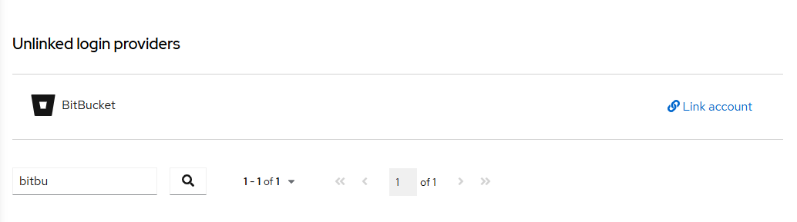
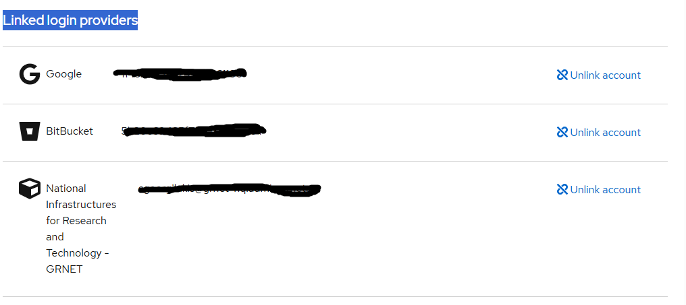

# Linking identities

## Linking new identities to your RCIAM Account

Identity linking allows you to access RCIAM resources with your existing personal
RCIAM ID, using any of the login credentials you have linked to your account. You
can use any of your organisational or social login credentials for this purpose.
To link a new organisational or social identity to your RCIAM account:

1. Enter the following URL in a browser: <https://rciam.example.org/auth/realms/{realmId}/account/#/security/linked-accounts>

1. Authenticate using any of the login credentials _already_
   linked to your RCIAM account

1. Under the **Unlinked login providers** pager section, search and find the identity you want to link to your existing account.
   Click **Link account** to this identity.

   

1. You will need to sign in using the login credentials from the
   institutional/social identity provider you want to link to your account.

   PS. If you saw the following error message:
   
   , you have already logged in and created a separate account for this Identity Provider.
   Please contact support in order to delete this account. 
   After deleting this account, you could proceed with linking this account with your existing account.

1. After successful authentication, the new Identity Provider will be available
   under the **Linked login providers** pager section. You'll be able to access RCIAM
   resources with your existing personal RCIAM ID using the login credentials of
   this identity provider.

    
