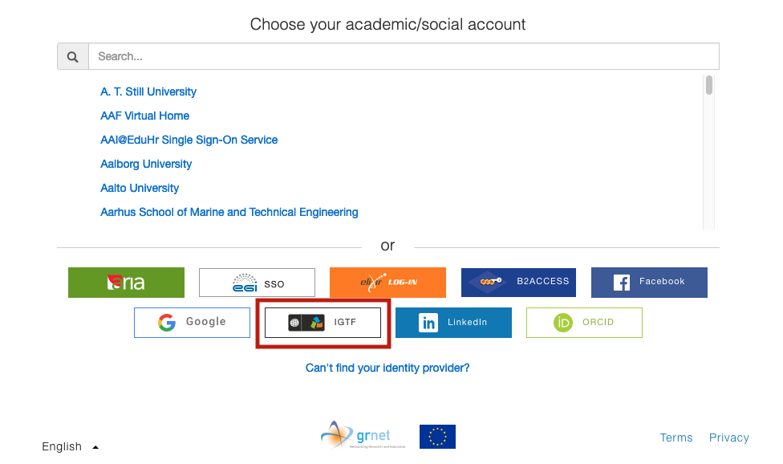

# Linking identities

## Linking new identities to your RCIAM Account

Identity linking allows you to access RCIAM resources with your existing personal
RCIAM ID, using any of the login credentials you have linked to your account. You
can use any of your organisational or social login credentials for this purpose.
To link a new organisational or social identity to your RCIAM account:

1. Enter the following URL in a browser: <https://rciam.example.org/registry>

1. Click **Login** and authenticate using any of the login credentials _already_
   linked to your RCIAM account

1. Navigate to **My RCIAM User Community Account** page in one of the following
   ways:

   - hover over your display name next to the gear icon on the top right corner
     of the page; _or, alternatively,_
   - select **RCIAM User Community** from the list of available Collaborations and
     then click **My RCIAM User Community Account** from the **People** menu

   

1. Under the **Organisational Identities** section of your profile page, expand
   **Actions** menu and click **Link New Identity**.

   

1. On the introductory page for Identity Linking, click **Begin**

   

1. You will need to sign in using the login credentials from the
   institutional/social identity provider you want to link to your account.

   :::caution

   It is very important to escape
   the identity provider selection, cached in the discovery page, before picking
   the new one.

   :::

1. After successful authentication, the new Identity Provider will be available
   under the Organizational Identities tab and you'll be able to access RCIAM
   resources with your existing personal RCIAM ID using the login credentials of
   the identity provider you selected in **Step 6**.

   

## Linking your certificate to your RCIAM Account

Certificate linking allows you to add the subject DN of your certificate to your
existing personal RCIAM ID. For this you need to import your certificate to your
browser.

To link a subject DN to your RCIAM account:

1. Enter the following URL in a browser: <https://rciam.example.org/registry>

1. Click **Login** and authenticate using any of the login credentials _already_
   linked to your RCIAM account

1. Navigate to **My RCIAM User Community Account** page in one of the following
   ways:

   - hover over your display name next to the gear icon on the top right corner
     of the page; _or, alternatively,_
   - select **RCIAM User Community** from the list of available Collaborations and
     then click **My RCIAM User Community Account** from the **People** menu

   

1. Under the **Organisational Identities** section of your profile page, expand
   **Actions** menu and click **Link New Identity**.

   

1. On the introductory page for Identity Linking, click **Begin**

   

1. Continuously, you will need to sign in using the IGTF Certificate Proxy.

   :::caution

   It is very important to escape
   the identity provider selection, cached in the discovery page, before picking
   the new one.

   :::

   

1. Then select the certificate you want to link to your account from the popup
   window.

   

1. After successful authentication you will be redirected back to your RCIAM
   Account. Also, you'll be able to access RCIAM resources with your existing
   personal RCIAM ID using **IGTF Certificate Proxy** and your certificate.

1. To verify that the subject DN is added to your RCIAM account scroll down to
   **Organisational Identities** and click on **view** button in the row where
   the source is
   `https://edugain-proxy.igtf.net/simplesaml/saml2/idp/metadata.php`.

   

1. Then scroll down to _Certificates_ and you should see the subject DN of your
   certificate.

   
